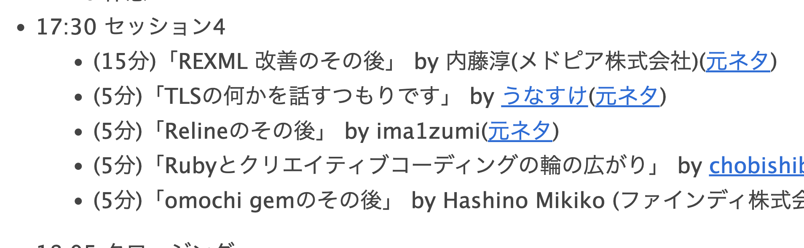
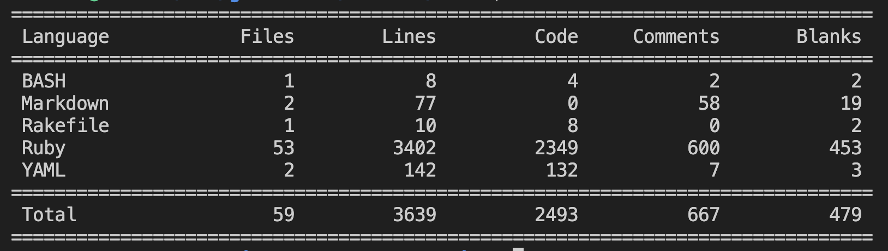
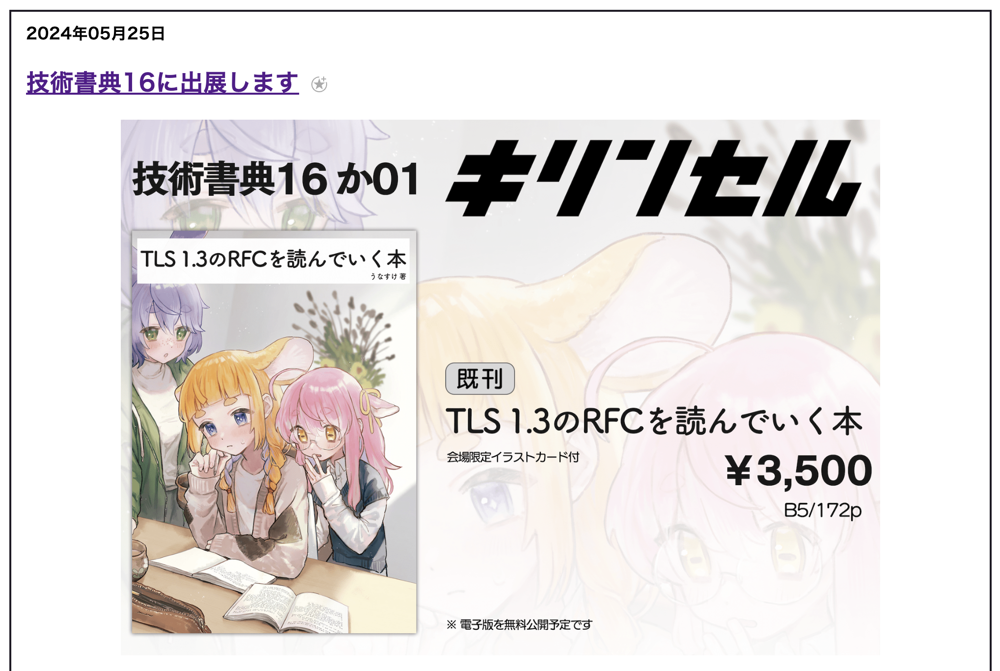

# RubyKaigi 2024 follow up

author
:   unasuke

content-source
:  RubyKaigi 2024 follow up

date
:  2024-08-31

theme
: theme

# 自己紹介

* Name: うなすけ
* Work: フリーランス
* Kaigi on Rails 2024オーガナイザー (10/25-26 開催)
* {::tag name='x-small'}GitHub <https://github.com/unasuke>{:/tag}
* {::tag name='x-small'}ActivityPub <https://mstdn.unasuke.com/@unasuke>{:/tag}
* {::tag name='x-small'}X (Twitter) <https://twitter.com/yu_suke1994>{:/tag}
* {::tag name='x-small'}<https://unasuke.com>{:/tag}

{:relative_width='24' align='right' relative_margin_right='-8' relative_margin_top='20'}

# 「TLSのなにか」

{:relative_width='100'}

# 進捗
{::tag name='center'}
{::tag name='x-large'}進捗ダメです{:/tag}
{:/tag}

# 経緯
1. QUICプロトコルをRubyで実装したい
2. 一旦Python実装のRuby移植は不完全ながらできた(これがGrantでの成果)
3. より"Rubyらしい"コードになるように実装し直している
4. QUICを実装するためにはTLS 1.3を実装しないといけない

# コードの進捗
{:relative_width='100'}

# コードの進捗
* 今日までに TLS ClientHelloくらいは構築できるようにしておきたかった
  * できませんでした

# コード外の進捗
* 本
* IETF 参加記

# コード外の進捗 : 本
{:relative_width='65'}

<https://blog.unasuke.com/2024/techbookfest16-tlsbook/>

# コード外の進捗 : 本
* <https://blog.unasuke.com/2024/techbookfest16-tlsbook/>
* TLS 1.3のRFCを日本語にしたもの
  * RFC 8446
* 物理はもうないです
  * 見本誌はもってきています
* 電子版公開がいつになるかちょっと……

# コード外の進捗 : IETF 参加記
* <https://blog.unasuke.com/tag/ietf/>
  * IETF 117 San Francisco
  * IETF 118 Prague
  * IETF 119 Brisbane
  * IETF 120 Vancouver
* QUIC, TLSに関しては他wgより気持ち丁寧めにまとめている(つもり)

# 今後の展望
* 明日からまた開発中断します
  * Kaigi on Rails 2024のため……
* 11月から復活！
  * できればいいですね……
